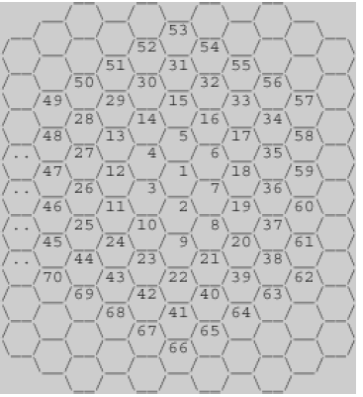

<!-- @format -->

# [벌집](https://www.acmicpc.net/problem/2292)

## 문제

  
위의 그림과 같이 육각형으로 이루어진 벌집이 있다. 그림에서 보는 바와 같이 중앙의 방 1부터 시작해서 이웃하는 방에 돌아가면서 1씩 증가하는 번호를 주소로 매길 수 있다. 숫자 N이 주어졌을 때, 벌집의 중앙 1에서 N번 방까지 최소 개수의 방을 지나서 갈 때 몇 개의 방을 지나가는지(시작과 끝을 포함하여)를 계산하는 프로그램을 작성하시오. 예를 들면, 13까지는 3개, 58까지는 5개를 지난다.

---

## 나의 풀이

방을 이렇게 보면  
거리가 멀어질 때 일정하게 개수가 늘어나는걸 알 수 있다.  
    

이런식으로 나누면 6개 정도로 나눌 수 있는데  
  

이런식으로 1개씩 늘어 나는 것을 알 수 있다.  
  

이게 총 6개 있으므로 6개씩 일정하게 늘어나는걸 알 수 있다.
