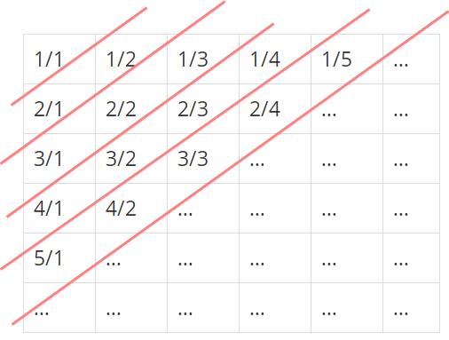

<!-- @format -->

# [분수 찾기](https://www.acmicpc.net/problem/1193)

## 문제

무한히 큰 배열에 다음과 같이 분수들이 적혀있다.

1/1 1/2 1/3 1/4 1/5 ……  
2/1 2/2 2/3 2/4 …… ……  
3/1 3/2 3/3 …… …… ……  
4/1 4/2 …… …… …… ……  
5/1 …… …… …… …… ……  
…… …… …… …… …… ……  
이와 같이 나열된 분수들을 1/1 -> 1/2 -> 2/1 -> 3/1 -> 2/2 -> … 과 같은 지그재그 순서로 차례대로 1번, 2번, 3번, 4번, 5번, … 분수라고 하자.

X가 주어졌을 때, X번째 분수를 구하는 프로그램을 작성하시오.

---

## 내 풀이

이렇게 보면 대각선을 한줄로 하며 한칸씩 내려갈때 마다 1개씩 늘어 난다.
그리고 1/1이 있는줄을 1째 줄이라 하면 홀수번째 줄들은 왼쪽 아래서 오른쪽 위로 번호를 매기고, 짝수번째 줄들은 오른쪽 위에서 왼쪽 아래로 번호를 매기므로

1, 2, 3, 4, 5, ... 이렇게 그룹을 묶은뒤 원하는 번호가 어느 그룹에 속하는지 본다음에 구하면 된다.   

참고로 홀수 번째 줄들은 n/1 -> (n-1)/2 -> (n-2)/3 -> ... -> 1/n 이고

짝수 번째 줄들은 1/n -> 2/(n-1) -> 3/(n-2) -> ... -> n/1 순으로 나열된다.
