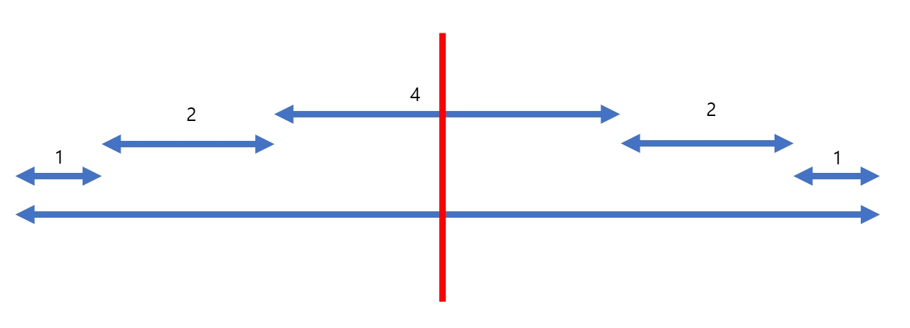
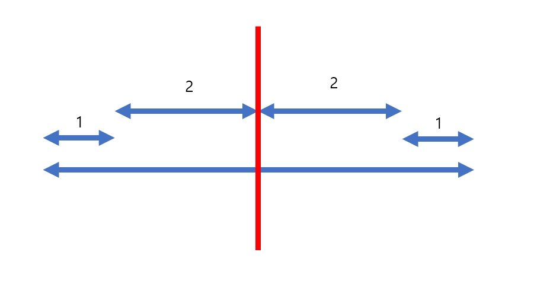

<!-- @format -->

# 문제

우현이는 어린 시절, 지구 외의 다른 행성에서도 인류들이 살아갈 수 있는 미래가 오리라 믿었다. 그리고 그가 지구라는 세상에 발을 내려 놓은 지 23년이 지난 지금, 세계 최연소 ASNA 우주 비행사가 되어 새로운 세계에 발을 내려 놓는 영광의 순간을 기다리고 있다.

그가 탑승하게 될 우주선은 Alpha Centauri라는 새로운 인류의 보금자리를 개척하기 위한 대규모 생활 유지 시스템을 탑재하고 있기 때문에, 그 크기와 질량이 엄청난 이유로 최신기술력을 총 동원하여 개발한 공간이동 장치를 탑재하였다. 하지만 이 공간이동 장치는 이동 거리를 급격하게 늘릴 경우 기계에 심각한 결함이 발생하는 단점이 있어서, 이전 작동시기에 k광년을 이동하였을 때는 k-1 , k 혹은 k+1 광년만을 다시 이동할 수 있다. 예를 들어, 이 장치를 처음 작동시킬 경우 -1 , 0 , 1 광년을 이론상 이동할 수 있으나 사실상 음수 혹은 0 거리만큼의 이동은 의미가 없으므로 1 광년을 이동할 수 있으며, 그 다음에는 0 , 1 , 2 광년을 이동할 수 있는 것이다. ( 여기서 다시 2광년을 이동한다면 다음 시기엔 1, 2, 3 광년을 이동할 수 있다. )


김우현은 공간이동 장치 작동시의 에너지 소모가 크다는 점을 잘 알고 있기 때문에 x지점에서 y지점을 향해 최소한의 작동 횟수로 이동하려 한다. 하지만 y지점에 도착해서도 공간 이동장치의 안전성을 위하여 y지점에 도착하기 바로 직전의 이동거리는 반드시 1광년으로 하려 한다.

김우현을 위해 x지점부터 정확히 y지점으로 이동하는데 필요한 공간 이동 장치 작동 횟수의 최솟값을 구하는 프로그램을 작성하라.

---

## 입력

입력의 첫 줄에는 테스트케이스의 개수 T가 주어진다. 각각의 테스트 케이스에 대해 현재 위치 x 와 목표 위치 y 가 정수로 주어지며, x는 항상 y보다 작은 값을 갖는다. (0 ≤ x < y < 231)

## 출력

각 테스트 케이스에 대해 x지점으로부터 y지점까지 정확히 도달하는데 필요한 최소한의 공간이동 장치 작동 횟수를 출력한다.

---

## 예제 입력

```
3
0 3
1 5
45 50
```

## 예제 출력

```
3
3
4
```

---

## 내 풀이



시작과 끝이 1이고 최소한의 움직임으로 도달해야하므로 그림과 같은 꼴로 나타나게 된다. (가운데가 가장 빠른 형태) <br>
그리고 이는 빨간선을 기준으로 대칭꼴 이므로 (완벽하지 않더라도) 절반을 나눠서 확인해 보면 된다.

이동하는 개수가 짝수일 경우와 홀수인 경우로 나누어 지는데, 저런식으로 대칭을 이루면서 채울때 남는공간이 하나로 매꾸어 지면 홀수개 인거고 2개가 필요하면 짝수개 인것이다.

이렇게 확인해도 문제가 없는 이유는 -1, 0, 1 중에 하나를 고르는 것이므로

위처럼 조금씩 조정이 되므로 크게 신경 안써도 된다.
