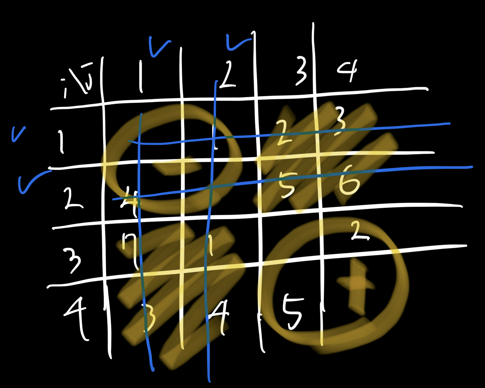

<!-- @format -->

기본적인 백트랙킹 했다가 타임아웃 나길래 (파이썬) 다른 사람 코드 한번 보고 다시 풂

위의 그림처럼 배열 전체의 합에서 파란색 선으로 그어진(각 팀원의 행과 열) 부분을 빼주면  
오른쪽 아래처럼 해당되지 않는 부분은(다른팀) 더해지고,  
왼쪽 아래와 오른쪽 위와 같은 부분은 없어지며,  
선이 두번식 그어진 왼쪽 부분은 두번씩 빼져서 -가 된다.  
즉 선택된 인원들이 팀A라 했을 때 'B의 점수 - A의 점수' 와 같게 된다  

그렇기에 각각 인원에 해당하는 행과 열의 합을 가지고 이를 활용할 수 있다.
